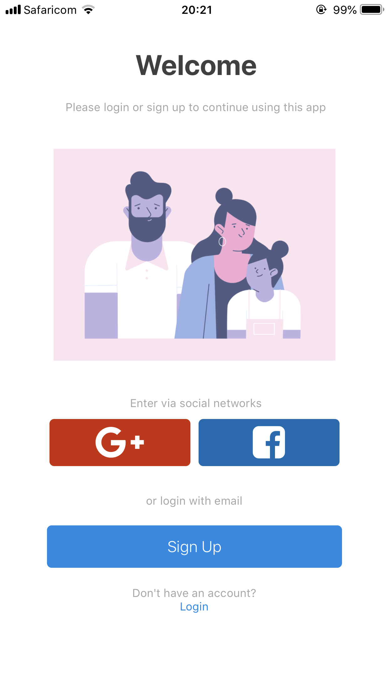
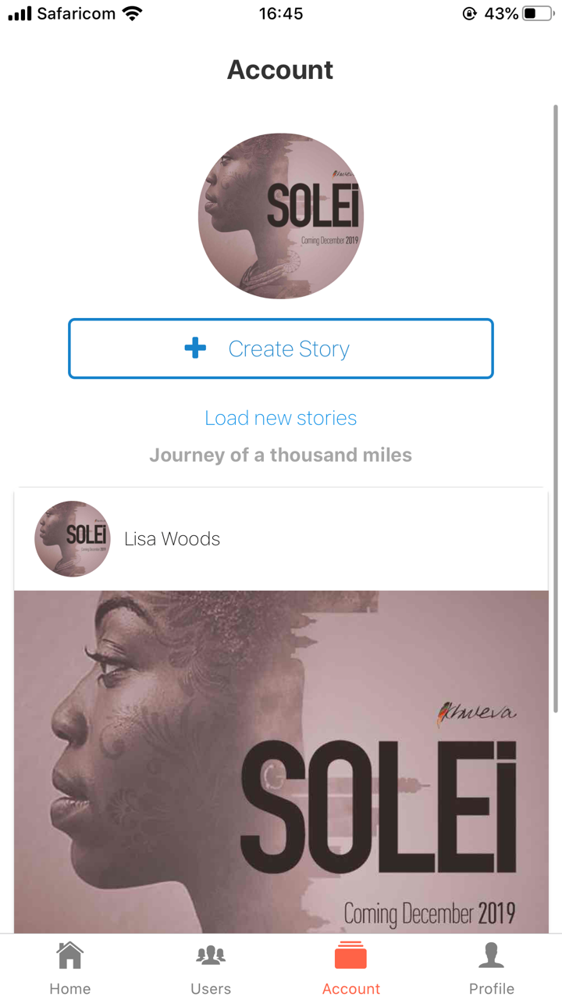
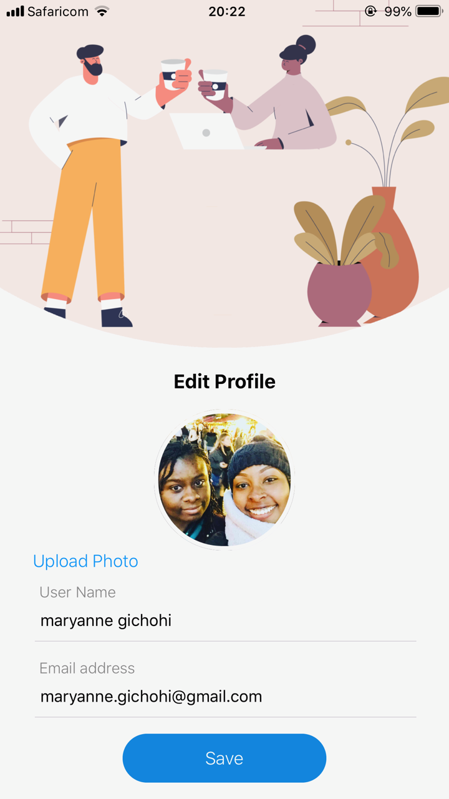
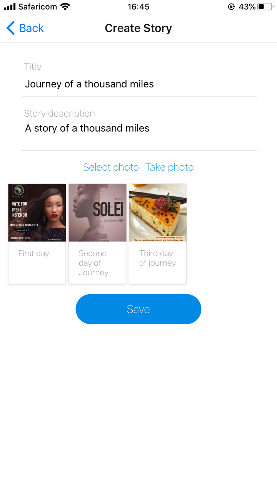
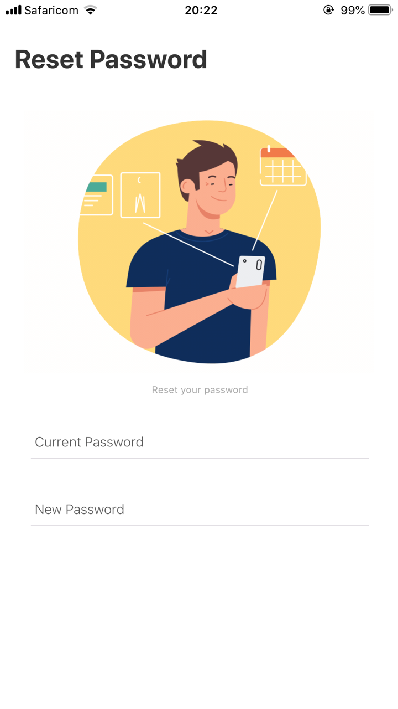

#  Picture App 
> This app allows you to tell a story of your day.By uploading several pictures that tell a story.

## Technologies used 
- React-Native 
- Expo
- Redux (for state management)
- Redux Thunk 
- Firebase (fire store)
- Cloudinary 
- Native base 
- React Navigation 

## Build SetUp 

``` bash 
# git clone the project.

# Install Node.js , click link   
https://tecadmin.net/install-latest-nodejs-npm-on-ubuntu/
sudo apt-get install nodejs

# Install expo cli 
npm install expo-cli --global

# install dependecies 
npm install 

# Run the application 
npm run start 
Install expo client app to your device 
available on App store and Android 

#Scan the QR code on your terminal.
``` 

## Test the Application. 
- To run this app without  cloning the project. 
- Click the link in the description. 
- Install the expo client app. 
- To your mobile device. 
- Available on Play store and App store.
- For Ios just open your camera and scan the QR code. 
- For android open expo client app and scan the QR code.  

## Picture App View 









